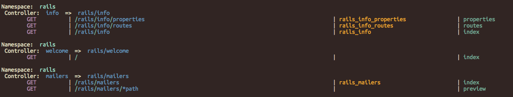

Routes Beautifier
===========

Routes Beautifier makes rake routes more readable.

Based on the work at: https://github.com/jt-platterz/colorized_routes

SUPPORTED VERSIONS: 4.x

# PREVIEW


# INSTALLATION
```bash
gem install routes_beautifier
```
or
```ruby
# In your Gemfile
gem 'routes_beautifier', git: 'https://github.com/jteneycke/routes_beautifier.git'
```
then run
```bash
bundle install
```

run the routes rake task to get your routes beautified!
```bash
rake routes
```
